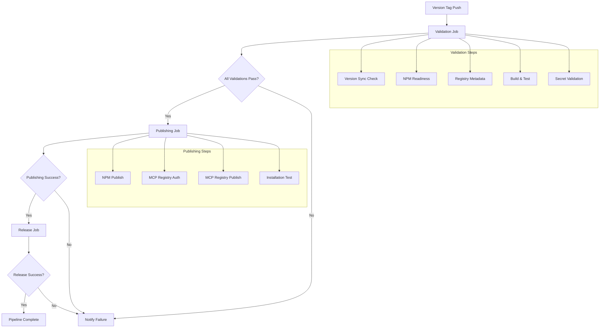

# Automated Publishing Pipeline

This document describes the automated publishing pipeline for the Financial Modeling Prep MCP Server, which publishes to both NPM Registry and MCP Registry using GitHub Actions.

## Overview

The automated publishing pipeline is triggered by version tags and handles the complete publishing workflow:

1. **Validation Phase**: Validates version consistency, metadata, and build readiness
2. **Publishing Phase**: Publishes to NPM Registry and MCP Registry
3. **Release Phase**: Creates GitHub release with auto-generated notes
4. **Verification Phase**: Verifies successful publication and installation methods

## Pipeline Architecture



## Workflow Configuration

### Triggers

- **Automatic**: Push of version tags (`v*` pattern)
- **Manual**: Workflow dispatch with optional dry-run mode

### Jobs

#### 1. Validate Job
- Extracts version from tag
- Validates version synchronization across files
- Validates server.json schema compliance
- Builds and tests the package
- Validates required secrets

#### 2. Publish Job
- Builds the package for distribution
- Installs MCP Publisher CLI from source
- Authenticates with MCP Registry using GitHub OIDC
- Publishes to NPM Registry (requires NPM_TOKEN)
- Waits for NPM propagation
- Publishes to MCP Registry
- Verifies registry publication
- Tests installation methods

#### 3. Release Job
- Creates GitHub release with auto-generated notes
- Includes installation instructions
- Links to registry entries

#### 4. Notify Failure Job
- Runs only on pipeline failure
- Provides troubleshooting guidance
- Suggests manual publishing fallback

## Required Configuration

### Repository Secrets

Configure these secrets in GitHub repository settings:

```bash
# Required for NPM publishing
NPM_TOKEN=npm_xxxxxxxxxxxxxxxxxxxxxxxxxxxxxxxx
```

### Repository Permissions

The workflow requires these permissions:
- `contents: write` - For creating GitHub releases
- `id-token: write` - For GitHub OIDC authentication with MCP Registry

## Usage

### Automated Publishing (Recommended)

1. **Prepare Release**:
   ```bash
   # Update version in package.json, server.json, and CHANGELOG.md
   npm run version:sync 2.5.1
   
   # Validate everything is ready
   npm run test:automated-pipeline
   ```

2. **Trigger Publishing**:
   ```bash
   # Create and push version tag
   git tag v2.5.1
   git push --tags
   ```

3. **Monitor Progress**:
   - Go to GitHub Actions tab
   - Watch "Automated Publishing Pipeline" workflow
   - Check each job for success/failure

### Manual Workflow Trigger

1. Go to GitHub Actions → "Automated Publishing Pipeline"
2. Click "Run workflow"
3. Optionally enable "dry_run" for testing
4. Click "Run workflow"

### Dry Run Testing

Test the pipeline without actual publishing:

```bash
# Local dry run testing
npm run publish:dry-run

# GitHub Actions dry run
# Use workflow_dispatch with dry_run=true
```

## Pipeline Features

### Validation & Safety
- ✅ Multi-stage validation before publishing
- ✅ Version consistency checks across all files
- ✅ Schema validation for registry metadata
- ✅ Build and test verification
- ✅ Secret availability validation
- ✅ Dry run support for testing

### Publishing & Distribution
- ✅ NPM Registry publishing with access control
- ✅ MCP Registry publishing with GitHub OIDC
- ✅ NPM package propagation verification
- ✅ Registry entry accessibility verification
- ✅ Installation method testing

### Error Handling & Recovery
- ✅ Comprehensive error handling at each stage
- ✅ Failure notification with troubleshooting guidance
- ✅ Timeout protection for external operations
- ✅ Conditional publishing based on validation results
- ✅ Manual publishing fallback documentation

### Monitoring & Verification
- ✅ Registry propagation checks
- ✅ Installation method verification
- ✅ Server startup testing
- ✅ Automatic GitHub release creation
- ✅ Detailed logging and status reporting

## Troubleshooting

### Common Issues

#### 1. NPM_TOKEN Not Configured
```
❌ NPM_TOKEN secret is not configured
```
**Solution**: Configure NPM_TOKEN in repository secrets

#### 2. Version Mismatch
```
❌ Version mismatch: server.json(2.5.0) vs package.json(2.5.1)
```
**Solution**: Run `npm run version:sync 2.5.1`

#### 3. Build Failure
```
❌ Build process failed
```
**Solution**: Fix TypeScript errors and run `npm run build` locally

#### 4. Registry Authentication Failure
```
❌ MCP Registry authentication failed
```
**Solution**: Check GitHub OIDC permissions and repository settings

#### 5. NPM Propagation Timeout
```
❌ NPM package propagation timeout
```
**Solution**: Wait and retry, or check NPM registry status

### Manual Recovery

If automated publishing fails, use manual publishing:

```bash
# Validate everything is ready
npm run publish:validate

# Manual publishing
npm run publish:manual

# Verify publication
npm run verify:registry-submission
```

### Pipeline Testing

Test the complete pipeline:

```bash
# Test automated pipeline components
npm run test:automated-pipeline

# Test complete workflow
npm run test:complete-workflow

# Test individual components
npm run version:validate
npm run verify:npm-ready
npm run verify:registry-submission
```

## Monitoring

### Success Indicators

1. **Validation Job**: All validation steps pass ✅
2. **Publishing Job**: Both NPM and MCP Registry publish successfully ✅
3. **Release Job**: GitHub release created ✅
4. **Verification**: Installation methods work ✅

### Post-Publication Verification

```bash
# Check NPM package
npm view financial-modeling-prep-mcp-server@2.5.1

# Check MCP Registry
curl -s "https://registry.modelcontextprotocol.io/api/servers/io.github.imbenrabi/financial-modeling-prep-mcp-server"

# Test installation
npm install -g financial-modeling-prep-mcp-server@2.5.1
fmp-mcp --help
```

## Best Practices

### Pre-Release Checklist

- [ ] Update CHANGELOG.md with release notes
- [ ] Run `npm run test:automated-pipeline` locally
- [ ] Verify all tests pass: `npm run test:run`
- [ ] Check version consistency: `npm run version:validate`
- [ ] Test dry run: `npm run publish:dry-run`

### Release Process

1. **Prepare**: Update version and documentation
2. **Validate**: Run automated pipeline tests
3. **Tag**: Create and push version tag
4. **Monitor**: Watch GitHub Actions workflow
5. **Verify**: Test installation after publication

### Maintenance

- Monitor workflow execution regularly
- Update dependencies in workflow when needed
- Test pipeline changes with dry runs
- Keep documentation updated with any changes

## Related Documentation

- [Manual Publishing Guide](./manual-publishing.md)
- [Version Synchronization](./version-sync.md)
- [Troubleshooting Guide](../scripts/manual-publish.ts)
- [GitHub Actions Workflow](../.github/workflows/release.yml)